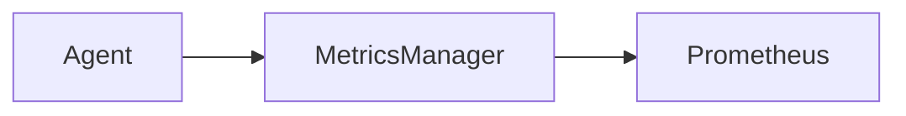

# CLI & GitOps

This page provides a cheatsheet for command-line interface (CLI) commands and an overview of the GitOps workflow used in the agent_system project.

## CLI Cheatsheet

| Command | Description |
|---------|-------------|
| `/run <command>` | Execute a terminal command. |
| `/git <command>` | Execute a git command. |
| `/gh <command>` | Execute a GitHub CLI command. |
| `/agent <agent_name> <command> [arguments]` | Interact with a specific agent. |
| `/workflow <task>` | Start a multi-agent workflow. |
| `/mem <command> [arguments]` | Interact with the ContextBus. |

## Safety Rails

Certain operations may be restricted or require user confirmation to prevent accidental data loss or system instability. These safety rails are in place to protect the project.

## Example PR from Chat

(This section would ideally contain an example of how a pull request is generated and managed through the chat interface, perhaps with screenshots or a step-by-step walkthrough. This is a placeholder for future content.)

## Monitoring

To enable Prometheus metrics, set the `ENABLE_METRICS` environment variable before running the application:

```bash
ENABLE_METRICS=1 streamlit run src/interfaces/gui.py
```

The metrics will be exposed on `http://localhost:9090/metrics` by default. If port 9090 is in use, the server will attempt to bind to the next available port (e.g., 9091, 9092, etc.).

You can visualize these metrics using Prometheus and Grafana.



- **Agent:** Various components within the agent system (tools, handlers) increment metrics.
- **MetricsManager:** Collects and exposes metrics via an HTTP server.
- **Prometheus:** Scrapes the metrics endpoint. 