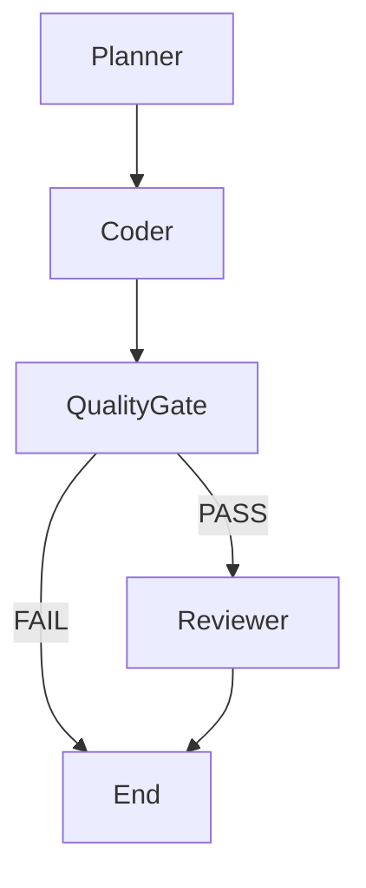
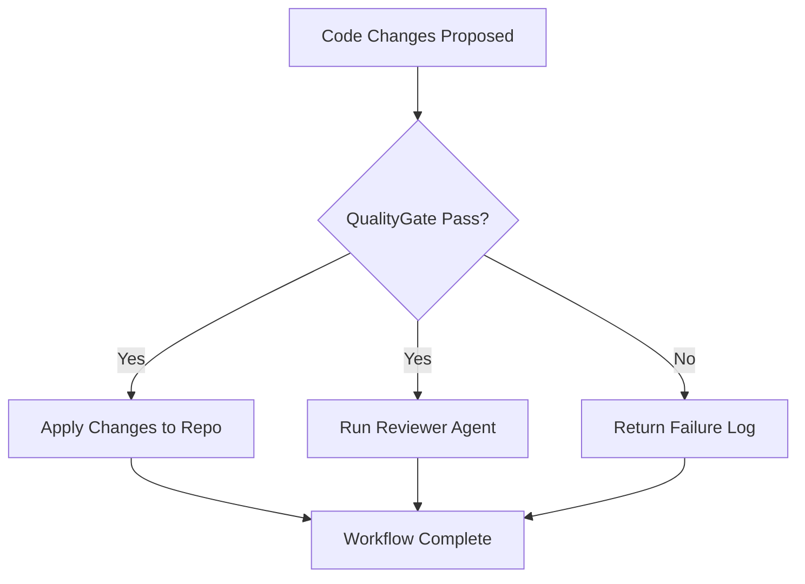

# Multi-Agent How-To

This guide explains how to use the multi-agent capabilities of the agent_system.

## Agent Commands

The primary command for interacting with agents is `/agent`. The basic syntax is:

```
/agent <agent_name> <command> [arguments]
```

Refer to the specific agent's documentation for available commands and arguments.

## Workflow (PCR Loop)

The main multi-agent workflow follows a Plan, Code, Review (PCR) loop orchestrated by the `/workflow` command.



- **Planner:** Breaks down a task into smaller steps.
- **Coder:** Implements the code changes based on the plan.
- **QualityGate:** Applies changes in a temporary environment and runs checks (Ruff, Pytest, MyPy, Bandit). Blocking on Ruff and Pytest.
- **Reviewer:** Provides a review of the code changes (only if QualityGate passes).

## ContextBus

The ContextBus acts as a shared memory or key-value store for agents to communicate and share information. You can inspect the ContextBus using the `/mem` command.

```
/mem list
/mem get <key>
/mem set <key> <value>
/mem delete <key>
```

Examples:

```
/mem get .plan
/mem list
```

## QualityGate Decision Tree



The Quality Gate checks the proposed code changes. If all checks pass (Ruff and Pytest are currently blocking), the changes are applied to the main repository, and the Reviewer Agent is invoked. If checks fail, the changes are not applied, and a failure log is returned. 